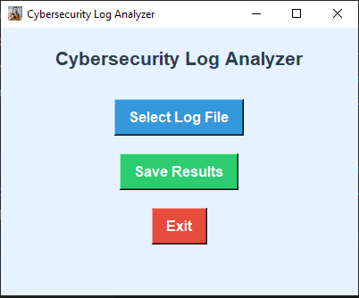
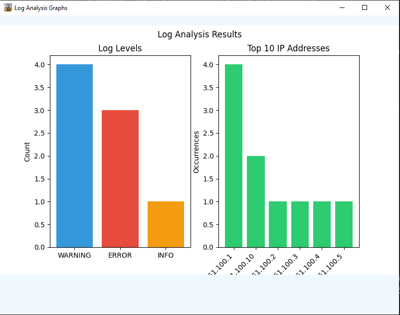
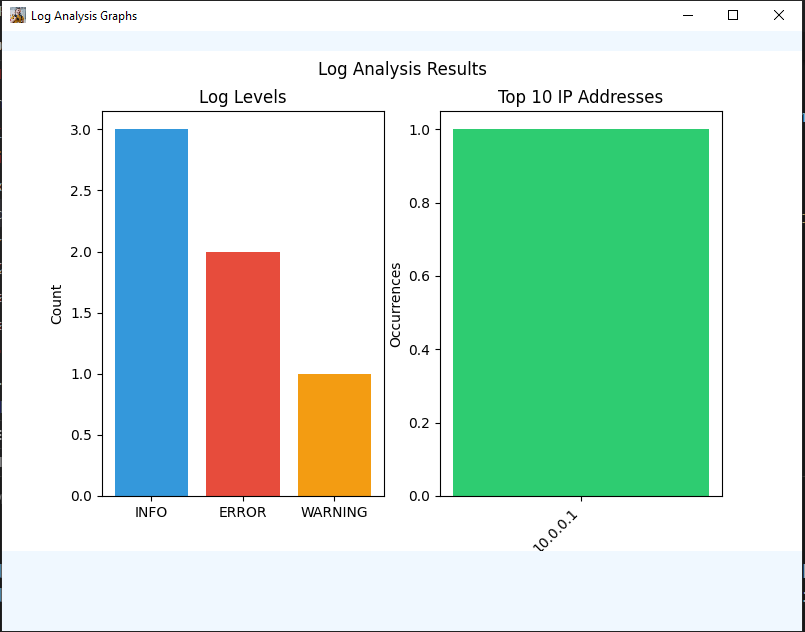

# Cybersecurity Log Analyzer

## Description
The **Cybersecurity Log Analyzer** is a Python application designed to analyze log files for different types of errors, warnings, and security incidents. It can detect log levels such as `INFO`, `ERROR`, and `WARNING`, as well as extract and count IP addresses found within the logs. It also provides graphical representations (using `matplotlib`) of log counts and top IP addresses. This tool is ideal for network administrators, cybersecurity professionals, and anyone dealing with log data for security monitoring.

## Features
- **Log Level Detection**: Analyzes logs to detect `INFO`, `ERROR`, and `WARNING` levels.
- **IP Address Extraction**: Extracts and counts IP addresses found within the log entries.
- **Uses regular expressions**: to find IP addresses in each line of the log
file.
- **Counts**: the occurrences of each IP address using the Counter class.
- **Prints the top 10 IP**: addresses by occurrence.
- **Graphical Representation**: Provides graphical charts of log counts and top IP addresses.
- **Save Results**: Allows users to save the log analysis results to a `.txt` file.
- **Error Handling**: Alerts for issues during log analysis, such as file read errors.
- **User-Friendly GUI**: Built with **Tkinter** for a clean, easy-to-use interface.
- **Exit Properly**: Correct handling of application exit to ensure the terminal is freed without manual interruption.

## Requirements
- **Python 3.x**
- **Tkinter**: For the graphical user interface.
- **Pillow (PIL)**: For handling `.ico` files.
- **Matplotlib**: For generating graphs and visualizing log data.

You can install the required libraries using the following:
```bash
pip install matplotlib pillow
```

## Installation
1. **Clone the repository**:
   ```bash
   git clone https://github.com/G-Muhammad/cybersecurity-log-analyzer.git
   ```
2. **Navigate to the project directory**:
   ```bash
   cd cybersecurity-log-analyzer
   ```

3. **Run the application**:
   ```bash
   python app.py
   ```

## How to Use
1. **Launch the application**: Run the script `app.py` to open the **Cybersecurity Log Analyzer** window.
2. **Select a log file**: Click on the "Select Log File" button to choose a log file you want to analyze.
3. **Analyze and view results**: The application will detect log levels (`INFO`, `ERROR`, `WARNING`) and extract IP addresses. It will display results graphically and show a pop-up summary.
4. **Save results**: Click on the "Save Results" button to save the analysis output to a `.txt` file.
5. **Exit the application**: Use the "Exit" button to close the window. The app will exit cleanly and free up the terminal.

## Screenshots

### Main Window


### Graphical Output




## Example Log Files
You can use these example logs to test the app:
- **log_sample_1.log**: Contains typical `INFO`, `ERROR`, and `WARNING` entries.
- **log_sample_2.log**: Simulates more complex scenarios like brute force attacks, DDoS attempts, and unauthorized access etc.

You can download or create your own logs with the following patterns:
- **INFO**: Normal system events.
- **ERROR**: Errors or failures in the system (e.g., login attempts, file issues).
- **WARNING**: System warnings or alerts (e.g., high CPU usage, low disk space).

## How It Works
1. The application reads the log file and identifies lines containing `INFO`, `ERROR`, and `WARNING`.
2. It uses **regular expressions** to find and count IP addresses.
3. The app generates **graphs** of the log counts and the top IP addresses using **matplotlib**.
4. The results can be saved to a `.txt` file for further review or analysis.

## Contributing
We welcome contributions! If you'd like to add features or improve the app, feel free to fork the repository, make changes, and submit a pull request.


## License
This project is licensed under the MIT License. Feel free to use it.

---

### **Additional Notes**:
1. **Exit Handling**: The app now correctly terminates and frees up the terminal when you press the **Exit** button, avoiding the need for manual `Ctrl + C`.
2. **Threading Considerations**: The log analysis is optimized to run efficiently and not block the GUI.
3. **Performance Optimizations**: The app reads logs in batches and uses pre-compiled regular expressions to improve performance.
